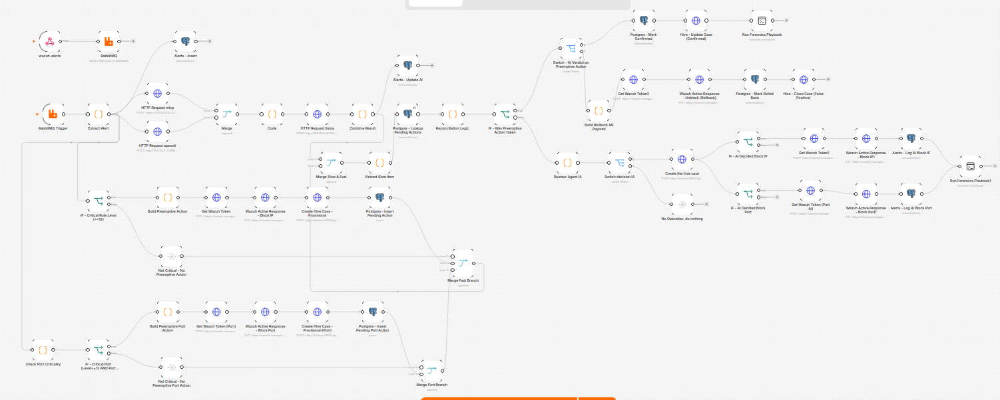

# SOC IA — Automated Detection & Response Pipeline

> **Blue Team** layer of an AI-assisted Security Operations Center.
> Detect → Enrich → Decide → Respond → Rollback → Forensics, all orchestrated automatically.



---

##  What this project does

A full **SOAR** (Security Orchestration, Automation & Response) pipeline that:

1. **Detects** threats via Suricata (network) and Sysmon (Windows endpoint)
2. **Centralizes** alerts in Wazuh SIEM
3. **Enriches** with Threat Intelligence from MISP + OpenCTI
4. **Decides** via AI analysis (LLaMA 3 through Ollama)
5. **Responds** automatically with iptables blocking (IP + port)
6. **Rolls back** if the AI verdict is "false positive" (with 4-level proof)
7. **Collects forensics** via Ansible for post-incident analysis

---

##  Architecture at a glance

| VM | Role | Stack |
|---|---|---|
| **VM SOC** (`100.64.0.11`) | Central orchestration | Wazuh, n8n, RabbitMQ, PostgreSQL, TheHive, Cortex |
| **VM CTI** (`100.64.0.13`) | Threat Intelligence | MISP, OpenCTI + 3 connectors |
| **VM AI** (`100.64.0.14`) | AI decision layer | FastAPI `/qualifier-alerte`, Ollama |
| **Monitored Linux** (`100.64.0.20`) | Detection endpoint | Wazuh agent, Suricata, iptables |
| **Monitored Windows** (`100.64.0.21`) | Detection endpoint | Wazuh agent + Sysmon |

All VMs interconnected via **Tailscale** overlay network.

---

## ⚡ Key features

### Fast Path (pre-blocking)
Alerts with `rule.level >= 12` trigger **immediate** IP and/or port blocking
**before** the AI analysis completes. This prevents critical threats from
spreading while the AI takes its time to reason.

### Reconciliation + Rollback
Once the AI verdict is back:
- If **true positive** → the pre-block is **confirmed** and the TheHive case is tagged `confirmed-by-ai`
- If **false positive** → the pre-block is **actually removed** via `unblock-ip0` / `unblock-port0`, and the case is closed with `resolutionStatus=FalsePositive` + tag `rolled-back`

Rollback is verified at **4 independent levels**: PostgreSQL, iptables, TheHive, and `auth.log`.

### Multi-action alerts
A single alert can trigger **multiple** simultaneous actions (e.g. `BLOCK_IP` + `BLOCK_PORT`) thanks to the `UNIQUE(correlation_id, action_type)` constraint on `pending_actions`.

---

##  The n8n workflow — 42 nodes, 7 logical blocks


| Block | Purpose |
|---|---|
| **B1 — Ingestion** | webhook → RabbitMQ → trigger → extract + `correlation_id` + insert into `alerts` |
| **B2 — CTI enrichment** | push IOCs to MISP + lookup OpenCTI in parallel |
| **B3 — Reconciliation** | read `pending` actions by `correlation_id` |
| **B4 — Fast path** | pre-block IP and/or port when level ≥ 12 |
| **B5 — AI decision** | call the AI layer (`100.64.0.14:8000/qualifier-alerte`) |
| **B6 — Confirm / rollback** | confirm or actually undo the pre-blocks |
| **B7 — AI actions + forensics** | execute AI-decided blocks + collect evidence |

👉 Full node-by-node breakdown: [docs/07-n8n-workflow.md](docs/07-n8n-workflow.md)

---

##  Quick start

```bash
# Clone
git clone https://github.com/noolatifa/soc-n8n-automation.git
cd soc-n8n-automation

# Copy real config from your environment (not shipped in this repo)
cp docker/pc1-soc/.env.example docker/pc1-soc/.env
cp docker/pc2-cti/.env.example docker/pc2-cti/.env
# Fill in the real values

# Start the stacks (on the VM SOC and VM CTI respectively)
cd docker/pc1-soc && docker compose up -d
cd docker/pc2-cti && docker compose up -d

# Import the workflow into n8n
# n8n UI → Workflows → Import from File → n8n/version-rapport.json
```

---

## Documentation

| Doc | Subject |
|---|---|
| [01](/docs/01-architecture.md) | Global architecture, VM topology, alert lifecycle |
| [02](/docs/02-reseau-tailscale.md) | Tailscale network, addressing plan, flow matrix |
| [03](/docs/03-docker-compose.md) | The two Docker stacks (VM SOC + VM CTI) |
| [04](/docs/04-wazuh.md) | Manager, agents, rules, Wazuh → n8n integration |
| [05](/docs/05-suricata.md) | Suricata NIDS: install, config, custom rules |
| [06](/docs/06-sysmon-windows.md) | Windows agent + Sysmon |
| [07](/docs/07-n8n-workflow.md) | The 42-node workflow, blocks B1–B7 |
| [08](/docs/08-wazuh-n8n-integration.md) | Custom Wazuh → n8n integration script |
| [09](/docs/09-active-response.md) | block/unblock IP+port scripts, rollback |
| [10](/docs/10-ansible-forensics.md) | Playbook, sudoers, SSH nodes |
| [11](/docs/11-postgresql.md) | Schema, constraints, `dashboard_ro` |
| [12](/docs/12-tests-validation.md) | curl scenarios + proofs |
---

##  Reproducible tests

6 scenarios are shipped as JSON payloads in `docs/12-tests-validation.md`. Each one can be replayed with a single `curl`:

```bash
curl -s -X POST http://100.64.0.11:5678/webhook/<id> \
  -H 'Content-Type: application/json' \
  -d @tests/scenarios/scenario1-level15.json
```

See [docs/11-tests-validation.md](docs/11-tests-validation.md) for the full matrix and expected proofs.

---

##  Tech stack

**SIEM & Detection** : Wazuh 4.14 · Suricata · Sysmon
**Orchestration** : n8n · RabbitMQ
**Threat Intelligence** : MISP · OpenCTI + MISP/MITRE/AbuseIPDB connectors
**Incident Management** : TheHive · Cortex
**Response** : iptables · Ansible
**Data** : PostgreSQL 16
**Network** : Tailscale
**Containers** : Docker Compose (24 containers)

---

##  AI layer

The `main` branch (this one) contains the **Blue Team orchestration layer** and
consumes the AI endpoint as a black box. Once the AI layer stabilizes, it will
be merged back here.

> Tested during the internship with a teammate's Ollama-based agent.
> My own SOC agent is the one being built in the `AI-layer` branch.
---

## 📂 Repository structure

```
soc-n8n-automation/
├── README.md                  ← you are here
├── docs/                      ← 12 technical documents (01 → 12)
├── docker/
│   ├── pc1-soc/               ← VM SOC stack (Wazuh + n8n + TheHive + …)
│   │   ├── docker-compose.yml
│   │   ├── .env.example
│   │   └── config/
│   │       ├── wazuh_cluster/ ← wazuh_manager.conf (ossec.conf)
│   │       └── integrations/  ← custom-n8n (Wazuh → n8n script)
│   └── pc2-cti/               ← VM CTI stack (MISP + OpenCTI)
│       ├── docker-compose.yml
│       └── .env.example
├── agents/
│   ├── suricata/              ← suricata.yaml + local.rules
│   ├── wazuh/                 ← agent configs (Linux + Windows)
│   └── sysmon/                ← sysmonconfig.xml
├── active-response/           ← block/unblock IP+port scripts + ar.conf
├── ansible/                   ← forensics playbook + sudoers 440
├── n8n/                       ← version-rapport.json (42-node workflow)
├── sql/                       ← schema.sql + dashboard_ro.sql
├── tests/scenarios/           ← 6 curl payloads
└── screenshots/               ← architecture & workflow images
```

---

